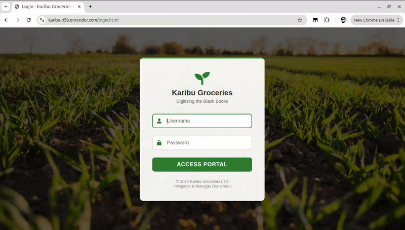

# 🥬 Karibu Groceries LTD - Digital Inventory System

A modern, full-stack inventory management solution designed to digitize the "Black Books" of produce retailers. Karibu Groceries enables real-time tracking of stock procurement, sales, and branch performance.



## 🚀 Live Demo
Check out the live application on Render: [**https://karibu-ri5b.onrender.com**](https://karibu-ri5b.onrender.com)

---

## ✨ Features
- **Director Dashboard:** Real-time revenue charts and branch-wide sales reports.
- **Manager Portal:** Procurement management, stock level tracking, and dealer records.
- **Sales Agent Interface:** Fast POS system for cash and credit sales with automated stock reduction.
- **Role-Based Security:** Specialized access for Directors, Managers, and Agents.
- **Cloud Database:** Powered by MongoDB Atlas for persistent data storage.

---

## 🛠️ Tech Stack
- **Frontend:** HTML5, CSS3, JavaScript (ES6+), Toastify.js, Chart.js
- **Backend:** Node.js, Express.js
- **Database:** MongoDB (via Mongoose ODM)
- **Deployment:** Render (Server), MongoDB Atlas (Cloud DB)

---

## 💻 Getting Started

### 1. Prerequisites
- [Node.js](https://nodejs.org/) installed
- [MongoDB Atlas](https://www.mongodb.com/cloud/atlas) account

### 2. Installation
```bash
# Clone the repository
git clone [https://github.com/godanaemiru/Karibu-](https://github.com/godanaemiru/Karibu-)
cd Karibu-

# Install dependencies
npm install

## 🔐 Demo Credentials

You can explore the different dashboards using the accounts below. Each role provides access to specific features (Analytics for Directors, Procurement for Managers, POS for Agents).

| Role | Username | Password | Branch Access |
| :--- | :--- | :--- | :--- |
| **Director** | `orban` | `123456` | All Branches (Global) |
| **Manager** | `manager_maganjo` | `123456` | Maganjo Branch |
| **Manager** | `manager_matugga` | `123456` | Matugga Branch |
| **Sales Agent** | `agent_maganjo` | `123456` | Maganjo Branch |
| **Sales Agent** | `agent_matugga` | `123456` | Matugga Branch |

> **Note:** These users are pre-seeded in the database via the `seed.js` script.
